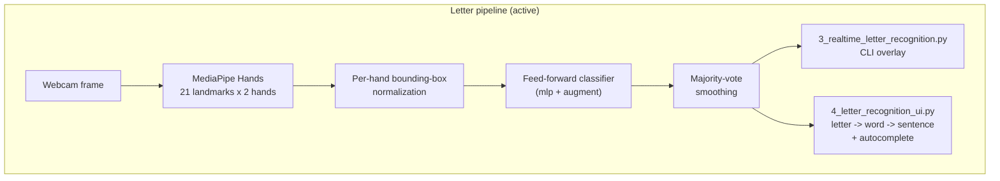
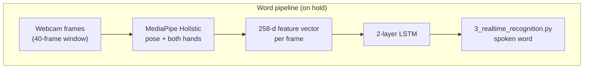
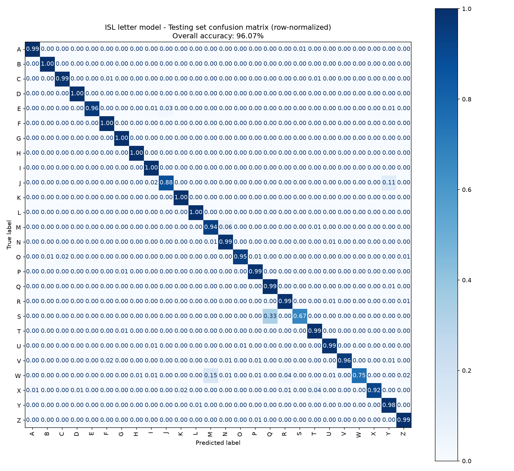

# Indian Sign Language (ISL) Recognition

A computer-vision system that reads hand shapes from a webcam and turns
them into text/speech, built around [MediaPipe](https://developers.google.com/mediapipe)
hand-landmark tracking and a [TensorFlow](https://www.tensorflow.org/)/Keras classifier
— no raw pixels are fed to the model, only the geometry of the hand.

Two independent pipelines live in this repo:

| Pipeline | Status | Recognizes | Approach |
|---|---|---|---|
| **Letters** | ✅ Active — this README's main focus | Static A-Z fingerspelling hand shapes | MediaPipe **Hands** → feed-forward classifier (per-frame) |
| **Words** | ⏸️ On hold, code intact | Isolated ISL words (INCLUDE dataset) | MediaPipe **Holistic** → 2-layer LSTM (per-40-frame clip) |

The two pipelines are architecturally different on purpose — letters are
**held poses** (no time dimension needed), words are **movements** (need a
sequence model). See [`letter_recognition_architecture.docx`](letter_recognition_architecture.docx)
and [`sign_language_project_documentation.docx`](sign_language_project_documentation.docx)
for the full design rationale of each, and [`TRAINING_LOG.md`](TRAINING_LOG.md)
for the running lab notebook of what was actually built, measured, and
debugged along the way.

## Contents

- [Tech stack](#tech-stack)
- [How it works](#how-it-works)
- [Letter pipeline](#letter-pipeline-a-z-static-hand-shapes) (active)
- [Fingerspelling UI + autocomplete](#fingerspelling-ui--autocomplete)
- [Word pipeline](#word-pipeline-include-dataset-on-hold) (on hold)
- [Setup](#setup)
- [Project structure](#project-structure)
- [Results](#results)
- [Known limitations](#known-limitations)
- [Documentation map](#documentation-map)

## Tech stack

| Layer | Tool | Why |
|---|---|---|
| Hand/pose tracking | **MediaPipe** (`solutions.hands` for letters, `solutions.holistic` for words) | Turns a webcam frame into a small, camera-invariant set of 3D landmark coordinates instead of raw pixels — the actual classifiers below only ever see numbers, not images |
| Camera I/O + drawing | **OpenCV** (`opencv-python`) | Webcam capture, BGR/RGB conversion, drawing landmark overlays |
| Modeling | **TensorFlow / Keras** | Dense/MLP, PointNet-style Conv1D, and Transformer (self-attention) architectures for letters; a 2-layer LSTM for words |
| Metrics | **scikit-learn** | `classification_report`, `confusion_matrix`, `f1_score` for held-out evaluation |
| Evaluation viz | **Matplotlib** | Confusion-matrix heatmap (`4_evaluate_letter_model.py`) |
| Desktop UI | **Tkinter** (stdlib) + **Pillow** | Live video + letter/word/sentence panel, autocomplete buttons — see [Fingerspelling UI](#fingerspelling-ui--autocomplete) |
| Speech output | **pyttsx3** | Offline text-to-speech, run on a background thread so it never blocks the camera loop |
| Data handling | **NumPy**, **pandas** | Landmark vectors as `.npy`, manifests/diagnostics as CSV |
| Language | **Python 3.11** | Everything above, on Windows |

Nothing here calls a cloud API — hand tracking, classification, autocomplete,
and speech are all local/offline once the environment is set up.

## How it works

Both pipelines share the same shape: video in → MediaPipe landmarks →
normalize → classifier → smooth over a few frames → act on the result
(speak it / type it).





Key design choices that shape everything downstream:

- **Landmarks, not pixels.** A trained model that only ever sees ~126
  numbers per frame (letters) or 258 (words) is far smaller, faster, and
  more robust to lighting/background than a CNN over raw video.
- **Per-hand normalization.** Each hand's landmarks are rescaled to that
  hand's own bounding box (`utils/hand_utils.py:normalize_landmarks`), so
  predictions don't depend on how close the signer is to the camera.
- **No time dimension for letters, an explicit one for words.** Letters
  are held poses classified frame-by-frame; words are movements, so the
  word pipeline resamples every clip to a fixed 40 frames and feeds the
  whole sequence to an LSTM.
- **Majority-vote smoothing at inference time**, on both pipelines, so a
  single flickery/misclassified frame doesn't flip the displayed
  prediction.

## Letter pipeline (A-Z, static hand shapes)

| Stage | Script | Input | Output |
|---|---|---|---|
| 1 | `1_extract_letter_landmarks.py` | ISL letter images | 126-d hand-landmark vectors (`.npy`) |
| 2 | `2_train_letter_model.py` | Landmark vectors | Trained classifier + label map |
| 3 | `3_realtime_letter_recognition.py` | Webcam frames | Predicted letter + optional speech (single-line CLI overlay) |
| 4 | `4_evaluate_letter_model.py` | Trained model + Testing split | Confusion-matrix heatmap + per-letter precision/recall |
| 4 | `4_letter_recognition_ui.py` | Webcam frames | Desktop UI: fingerspelling → word (with autocomplete) → sentence |

```
.venv\Scripts\python 1_extract_letter_landmarks.py
.venv\Scripts\python 2_train_letter_model.py --arch mlp --augment
.venv\Scripts\python 3_realtime_letter_recognition.py
.venv\Scripts\python 4_evaluate_letter_model.py
.venv\Scripts\python 4_letter_recognition_ui.py
```

**Dataset**: [RealSign ISL alphabet dataset](https://github.com/RealSign62/RealSign-Indian-Sign-Language-Dataset)
(CC0-1.0), expected at `data/letters_raw/{Training,Validation,Testing}/<letter>/*.jpg`.
That folder's own split is used as-is — `Testing` is a genuine held-out
set, not a random re-split, so reported accuracy isn't inflated by
signer/image leakage between train and test.

**Model selection**: `2_train_letter_model.py` supports four architectures
(`--arch mlp|wide_mlp|pointnet|transformer`) and an optional `--augment`
flag (random rotation/scale/translation jitter applied to training data
only). All four were compared under a fixed `--seed` on the same held-out
Testing split — `mlp --augment` won and is the canonical
`models/letter_model.keras`. Full comparison table, why the fancier
architectures (PointNet, Transformer) *lost* to a plain MLP, and a Keras
serialization gotcha for anyone adding a new custom layer: see
[`TRAINING_LOG.md`](TRAINING_LOG.md).

MediaPipe Holistic (used by the word pipeline) needs pose/body context to
locate hands and detects nothing on these close-up hand images, which is
why the letter pipeline uses MediaPipe **Hands** directly instead
(`utils/hand_utils.py`).

## Fingerspelling UI + autocomplete

`4_letter_recognition_ui.py` is a Tkinter desktop app that turns a
*sequence* of recognized letters into typed words and sentences, instead
of just overlaying one letter on the video like stage 3:

- Hold a letter shape steadily → it's typed once into the current word.
  A small "hold to type, release to re-arm" state machine
  (`--release-frames`) sits on top of the existing confidence-threshold +
  majority-vote smoothing so a held pose doesn't spam the same letter
  repeatedly.
- As letters accumulate, `utils/autocomplete.py` (`WordCompleter`) matches
  the in-progress word against a static, frequency-ranked ~9,900-word
  English list (`data/word_list.txt`) and shows up to 5 suggestions —
  click one, or press `1`-`5`, to complete the word instantly instead of
  spelling every letter.
- Finalized words build up into a full sentence, which can be spoken
  aloud (`pyttsx3`) either word-by-word as you go or all at once.

```
.venv\Scripts\python 4_letter_recognition_ui.py
```

Full usage guide (every flag, the exact commit state machine, editing
controls, and known limitations of the autocomplete): **[`LETTER_UI.md`](LETTER_UI.md)**.

## Word pipeline (INCLUDE dataset, on hold)

| Stage | Script | Input | Output |
|---|---|---|---|
| 1 | `1_extract_landmarks.py` | INCLUDE videos | `40 × 258` landmark sequences (`.npy`) |
| 2 | `2_train_model.py` | Landmark sequences | Trained LSTM + label map |
| 3 | `3_realtime_recognition.py` | Webcam frames | Predicted word + optional speech |

Each frame is encoded as 258 features: pose (33 landmarks × x, y, z,
visibility = 132) + left hand (21 × x, y, z = 63) + right hand (21 × x, y,
z = 63); the face mesh is excluded. Every video is uniformly resampled to
40 frames. `SEQ_LEN` and `FEATURE_DIM` live in `utils/mp_utils.py` and are
imported by all three stages so extraction/training/inference can't drift
out of sync.

```
.venv\Scripts\python 1_extract_landmarks.py --raw-dir data/raw --out-dir data/processed
.venv\Scripts\python 2_train_model.py --epochs 100 --batch-size 16 --val-split 0.2
.venv\Scripts\python 3_realtime_recognition.py --confidence-threshold 0.80 --cooldown 2.0
```

Dataset layout expected (download the [INCLUDE dataset](https://zenodo.org/record/4010759)
or your own ISL video set):

```
data/raw/<category>/<word>/<video>.mp4
```

e.g. `data/raw/Greetings/hello/MVI_0001.mp4` — the word/class label is
taken from the immediate parent folder of each video.

This pipeline is intentionally untouched while the letter pipeline is the
active focus; see [Known limitations](#known-limitations) and
`sign_language_project_documentation.docx` (Improvement Plan) before
resuming it.

## Setup

A working environment is already built at `.venv` (Python 3.11). To
recreate it elsewhere:

```
python -m venv .venv
.venv\Scripts\pip install -r requirements.txt
```

`mediapipe`'s legacy `solutions.holistic`/`solutions.hands` API (used
here) was removed in mediapipe 1.0+, and it requires `numpy<2` /
`protobuf<5`. `requirements.txt` pins a set verified to install and run
together on Windows + Python 3.11 — don't casually bump individual
packages without re-checking this.

## Project structure

```
MLProject/
├── README.md                              this file
├── TRAINING_LOG.md                        lab notebook: dataset versions, bugs found, model comparisons
├── LETTER_UI.md                           fingerspelling UI: design, flags, controls, limitations
├── letter_recognition_architecture.docx   full design doc, letter pipeline
├── sign_language_project_documentation.docx  full design doc, word pipeline
├── requirements.txt                       pinned, verified-compatible dependency set
│
├── utils/
│   ├── hand_utils.py         MediaPipe Hands setup, 126-d feature extraction/normalization/drawing
│   ├── mp_utils.py           MediaPipe Holistic setup, 258-d feature extraction, SEQ_LEN/FEATURE_DIM
│   ├── custom_layers.py      RandomLandmarkAugment, AddPositionEmbedding (registered Keras layers)
│   ├── autocomplete.py       WordCompleter — frequency-ranked prefix autocomplete
│   └── tts_utils.py          SpeechWorker — non-blocking background TTS, shared by both pipelines
│
├── 1_extract_letter_landmarks.py    letters, stage 1
├── 2_train_letter_model.py          letters, stage 2
├── 3_realtime_letter_recognition.py letters, stage 3 (CLI overlay)
├── 4_evaluate_letter_model.py       letters, stage 4 (confusion matrix)
├── 4_letter_recognition_ui.py       letters, stage 4 (desktop UI + autocomplete)
│
├── 1_extract_landmarks.py           words, stage 1
├── 2_train_model.py                 words, stage 2
├── 3_realtime_recognition.py        words, stage 3
│
├── data/
│   ├── word_list.txt              tracked — autocomplete dictionary (~9,900 words)
│   ├── letters_raw/               untracked — RealSign dataset (Training/Validation/Testing/<letter>)
│   ├── letters_processed/         untracked — extracted landmark vectors, labels.json, manifest.csv
│   ├── raw/                       untracked — INCLUDE dataset (<category>/<word>/<video>.mp4)
│   └── processed/                 untracked — extracted landmark sequences
│
└── models/
    ├── letter_model.keras / .labels.json             canonical letter model (mlp + augment)
    ├── letter_model_<arch>[_aug].keras / .labels.json  the other trained architectures, kept for comparison
    ├── letter_model_confusion_matrix.png / .csv       held-out test-set confusion matrix
    └── sign_model.keras / .labels.json                word pipeline model (once trained)
```

`data/letters_raw/`, `data/letters_processed/`, `data/raw/`, and
`data/processed/` are gitignored (large downloaded/derived datasets);
`data/word_list.txt` is the one file under `data/` that *is* tracked,
since it's a small code dependency (`utils/autocomplete.py`) rather than
a dataset.

## Results

The canonical letter model (`mlp --augment`, seed 42) scores **96.07% accuracy / 0.9596 macro F1**
on the held-out RealSign Testing split (4,636 images after dropping
detection-failure zero-vectors):



Recall is 95–100% for nearly every letter; the remaining errors cluster on
a few visually similar hand shapes — **S** (0.67 recall, mostly confused
with Q), **W** (0.75, confused with M), and **X** (0.92, confused with T).
Full architecture comparison (`mlp` vs `wide_mlp` vs `pointnet` vs
`transformer`, with/without augmentation) and the reasoning behind each
result: [`TRAINING_LOG.md`](TRAINING_LOG.md).

The word pipeline has no held-out test set yet (see limitations below),
so no comparable held-out accuracy is reported for it.

## Known limitations

**Letter pipeline** — a validated baseline, with real remaining gaps:
- Confusion is concentrated on a few hand-shape pairs (S/Q, W/M, X/T) —
  see [Results](#results).
- `--confidence-threshold` / `--smoothing-window` are hand-picked, not
  formally calibrated; the fingerspelling UI's `--release-frames` latch is
  new and similarly untuned against multiple real signers.
- Autocomplete is a static prefix dictionary with no grammar/context
  model — see [`LETTER_UI.md`](LETTER_UI.md#known-limitations) for the
  full list.

**Word pipeline** — intentionally paused before these were addressed:
- The train/validation split is random, not signer-independent — it can
  overstate accuracy if the same signer appears in both splits.
- No held-out test set, no landmark normalization (coordinates are raw,
  camera/scale-dependent), no "no-sign"/background class, and no temporal
  smoothing across predictions.
- Confidence threshold (0.80) is a fixed cutoff, not a calibrated
  probability.

These word-pipeline items are the "Phase 2+" items in
`sign_language_project_documentation.docx`'s Improvement Plan — check that
doc before resuming this pipeline.

## Documentation map

| Doc | Covers |
|---|---|
| `README.md` (this file) | Project overview, tech stack, workflow, setup, results |
| `TRAINING_LOG.md` | Dataset versions, bugs found and fixed, full model-architecture comparison, UI build notes — the chronological "what actually happened" record |
| `LETTER_UI.md` | Fingerspelling UI: every flag, the letter-commit state machine, autocomplete internals, editing controls, limitations |
| `letter_recognition_architecture.docx` | Full design rationale + 3 cited papers behind the letter pipeline's landmark normalization and architecture choices |
| `sign_language_project_documentation.docx` | Full design doc + Improvement Plan for the word pipeline |
